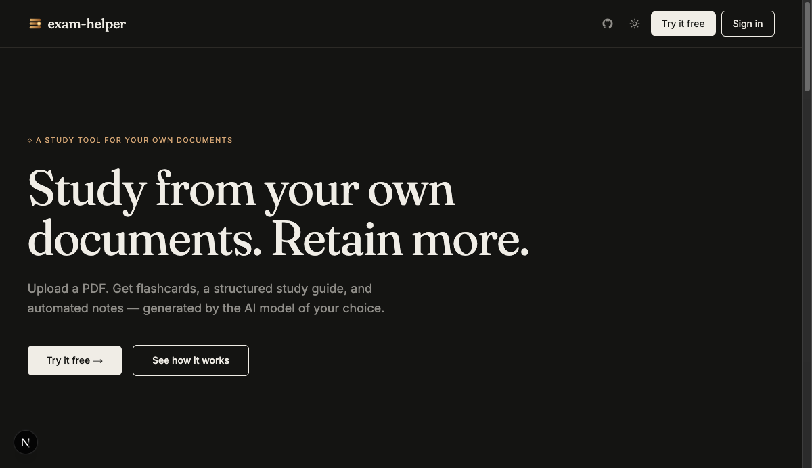
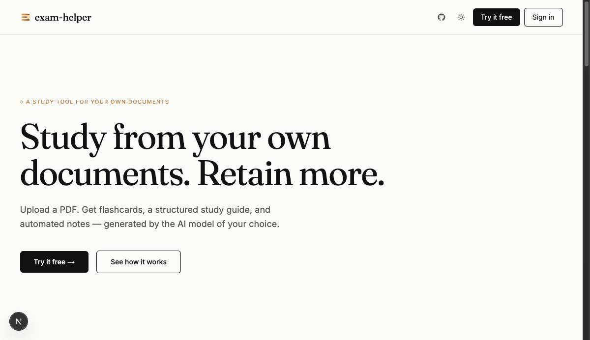
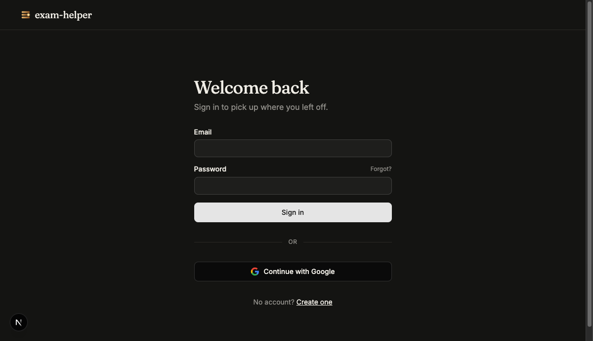

<div align="center">
  
</div>

<br/>

<div align="center">
  <strong>Turn your documents into a full study system — powered by the AI model you already pay for.</strong><br/>
  Upload a PDF, pick your provider, and get flashcards, structured notes, a study guide, and a gamified learning roadmap in seconds.
</div>

<br/>

<div align="center">

[](https://github.com/anasyd/exam-helper/pkgs/container/exam-helper-server)
[](https://github.com/anasyd/exam-helper/pkgs/container/exam-helper-web)
[](LICENSE)

</div>

---

## Screenshots

| Dark | Light |
|------|-------|
|  |  |

<details>
<summary>Sign-in page</summary>
<br/>

</details>

---

## Features

- **Bring your own AI** — Gemini, OpenAI, Claude, OpenRouter. Configure once, swap per feature. We never touch your API keys.
- **Flashcards + spaced repetition** — cards you struggle with surface more often; mastered cards fade out.
- **Study guides** — structured notes extracted from your document, section by section.
- **Gamified roadmap** — a Duolingo-style learning path through your material. Complete topics to unlock the next, earn XP, track progress.
- **Background generation** — close the tab and come back. Your API key is RSA-encrypted in transit and deleted the moment the job finishes.
- **Vision-aware** — flagship models read PDFs directly; diagrams, equations, and scanned pages stay intact.
- **Sync across devices** — projects, flashcards, and study guides synced via your account.
- **Auth built in** — email/password + Google OAuth, password reset, email verification.
- **Tier system** — Free, Student, and Pro plans with enforced project and file limits.
- **Self-hostable** — single Docker Compose file, deploys to [Coolify](https://coolify.io) in minutes. MongoDB included.
- **Registration control** — `REGISTRATION_MODE=invite-only` locks signups; admin creates accounts manually.

---

## Stack

| Layer | Tech |
|-------|------|
| Frontend | Next.js 16, Tailwind CSS, shadcn/ui |
| Backend | Express 4, TypeScript, Better Auth |
| Database | MongoDB 8 (bundled or Atlas) |
| Email | Resend |
| Auth | Better Auth (email/pw + Google OAuth) |
| Payments | Stripe (optional) |
| Containers | Docker, GHCR |

---

## Monorepo structure

```
exam-helper/
├── web/      # Next.js frontend   — ghcr.io/anasyd/exam-helper-web
└── server/   # Express backend    — ghcr.io/anasyd/exam-helper-server
```

---

## Self-hosting

See **[docs/self-hosting.md](docs/self-hosting.md)** for the full Coolify deployment guide — auto-generated secrets, one-compose setup, smoke-test checklist.

---

## Local development

**Backend**
```bash
cd server
cp .env.example .env   # fill in values
npm install
npm run dev            # http://localhost:4000
```

**Frontend**
```bash
cd web
cp .env.example .env.local   # defaults work for local dev
npm install
npm run dev                  # http://localhost:3000
```
